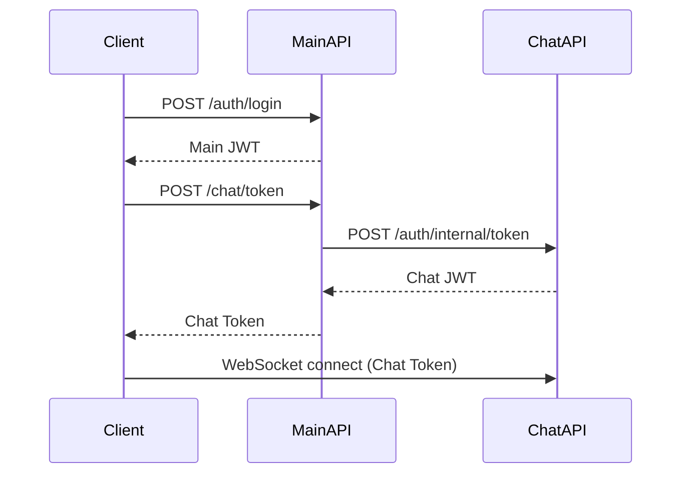

# Chat Microservice

Real-time chat microservice for the NNS platform, supporting direct conversations and LegalEntity inbox channels.

## Features

- **Direct Conversations**: One-to-one chats between users
- **LegalEntity Channels**: Company inbox where ADMIN users communicate with company employees
- **Real-time Messaging**: WebSocket (Socket.io) for instant message delivery
- **Permission-based Access**: Read/write permissions per legal entity
- **Cursor-based Pagination**: Efficient message history loading

## Architecture

```
├── domain/           # Business entities and repository interfaces
├── application/      # Services and business logic
├── infrastructure/   # Database implementations and WebSocket
└── routes/          # REST API endpoints
```

## Quick Start

### Prerequisites

- Node.js 20+
- MongoDB (local or Atlas)

### Development

```bash
# Install dependencies
yarn install

# Copy environment variables
cp .env.example .env

# Start MongoDB (using Docker)
docker compose up mongo -d

# Run in development mode
yarn dev
```

### Production

```bash
# Build
yarn build

# Start
yarn start
```

### Docker

```bash
# Run everything with Docker Compose
docker compose up -d
```

## Environment Variables

| Variable | Description | Default |
|----------|-------------|---------|
| `CHAT_PORT` | Server port | `3001` |
| `CHAT_JWT_SECRET` | JWT secret for chat tokens | - |
| `CHAT_JWT_EXPIRES_IN` | Token expiration | `24h` |
| `MONGODB_URI` | MongoDB connection string | - |
| `INTERNAL_API_KEY` | Key for Main API communication | - |

## API Endpoints

### Authentication (Internal)

| Method | Endpoint | Description |
|--------|----------|-------------|
| POST | `/auth/internal/token` | Generate chat token (called by Main API) |
| POST | `/auth/verify` | Verify a chat token |

### Conversations (REST)

| Method | Endpoint | Description |
|--------|----------|-------------|
| GET | `/conversations` | List user's conversations |
| GET | `/conversations/:id` | Get conversation details |
| POST | `/conversations` | Start new conversation |
| GET | `/conversations/:id/messages` | Get messages with pagination |

### Channels (REST)

| Method | Endpoint | Description |
|--------|----------|-------------|
| GET | `/channels` | List accessible channels |
| GET | `/channels/:id` | Get channel details |
| GET | `/channels/legal-entity/:id` | Get/create channel by legal entity |
| GET | `/channels/:id/messages` | Get messages with pagination |
| GET | `/channels/:id/permissions` | Check user permissions |

## WebSocket Events

### Client → Server

| Event | Payload | Description |
|-------|---------|-------------|
| `conversation:join` | `{ conversationId }` | Join conversation room |
| `conversation:start` | `{ targetUserId }` | Start new conversation |
| `channel:join` | `{ legalEntityId, legalEntityName? }` | Join channel room |
| `message:send` | `{ target, targetId, content }` | Send message |
| `messages:get` | `{ target, targetId, cursor?, limit? }` | Load more messages |
| `conversations:list` | - | Get conversations list |
| `channels:list` | - | Get channels list |

### Server → Client

| Event | Payload | Description |
|-------|---------|-------------|
| `conversation:joined` | `{ conversationId, messages, hasMore }` | Joined conversation |
| `conversation:started` | `{ conversation, messages, hasMore }` | New conversation created |
| `channel:joined` | `{ channel, messages, hasMore }` | Joined channel |
| `message:new` | `{ message }` | New message received |
| `messages:loaded` | `{ target, targetId, messages, hasMore, nextCursor }` | Messages loaded |
| `conversations:listed` | `{ conversations }` | Conversations list |
| `channels:listed` | `{ channels }` | Channels list |
| `user:online` | `{ userId }` | User came online |
| `user:offline` | `{ userId }` | User went offline |
| `error` | `{ code, message }` | Error occurred |

## Permission Model

### User Types

- **ADMIN**: Can access all channels, send messages to any legal entity
- **Supplier**: Can only access channels for their legal entities

### Channel Permissions

| Permission | Description |
|------------|-------------|
| `canRead` | User can view messages in the channel |
| `canWrite` | User can send messages to the channel |

Permissions are set per user-legalEntity relationship in the Main API.

## Integration with Main API

The Main API provides:
1. `POST /chat/token` - Generate chat token for authenticated users
2. `GET /chat/status` - Get user's chat permissions
3. `PUT /chat/permissions/:userId` - Update chat permissions (Admin only)

### Client Flow



